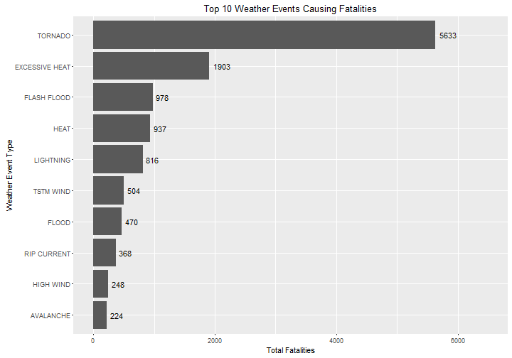
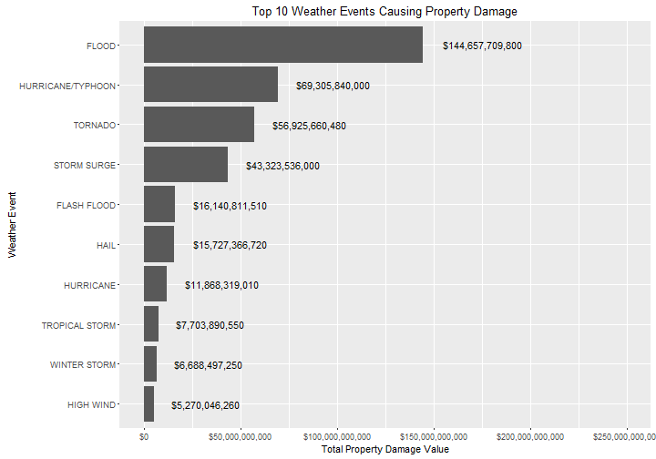

# Synopsis

This report reviews the effects of severe weather events on both the population and the economy. This is an investigative report in that we are seeking to determine which event types have historically caused the most fatalities (a measure of population impact) and property damage (a measure of economic cost). Data was obtained from the U.S. National Oceanic and Atmospheric Administration's (NOAA) storm database. The events start in the year 1950 and end in November 2011. The conclusion is that tornados cause the most harm to the population in terms of fatalities and floods cause the most economic cost.

# Data Processing

The first step is to load the packages that will be used for data manipulation/wrangling and plotting. 


```r
# Data wrangling
library(dplyr)
library(tidyr)

# Plotting
library(ggplot2)

# Tables
library(pander)
```

Next, the data is loaded using the `read.table` function.


```r
stormDataRaw <- read.table("repdata-data-StormData.csv.bz2", header = TRUE, sep = ",")
```

We call the `head` function to make a quick check of the dataset.


```r
head(stormDataRaw)
```

```
##   STATE__           BGN_DATE BGN_TIME TIME_ZONE COUNTY COUNTYNAME STATE  EVTYPE BGN_RANGE BGN_AZI BGN_LOCATI END_DATE
## 1       1  4/18/1950 0:00:00     0130       CST     97     MOBILE    AL TORNADO         0                            
## 2       1  4/18/1950 0:00:00     0145       CST      3    BALDWIN    AL TORNADO         0                            
## 3       1  2/20/1951 0:00:00     1600       CST     57    FAYETTE    AL TORNADO         0                            
## 4       1   6/8/1951 0:00:00     0900       CST     89    MADISON    AL TORNADO         0                            
## 5       1 11/15/1951 0:00:00     1500       CST     43    CULLMAN    AL TORNADO         0                            
## 6       1 11/15/1951 0:00:00     2000       CST     77 LAUDERDALE    AL TORNADO         0                            
##   END_TIME COUNTY_END COUNTYENDN END_RANGE END_AZI END_LOCATI LENGTH WIDTH F MAG FATALITIES INJURIES PROPDMG PROPDMGEXP
## 1                   0         NA         0                      14.0   100 3   0          0       15    25.0          K
## 2                   0         NA         0                       2.0   150 2   0          0        0     2.5          K
## 3                   0         NA         0                       0.1   123 2   0          0        2    25.0          K
## 4                   0         NA         0                       0.0   100 2   0          0        2     2.5          K
## 5                   0         NA         0                       0.0   150 2   0          0        2     2.5          K
## 6                   0         NA         0                       1.5   177 2   0          0        6     2.5          K
##   CROPDMG CROPDMGEXP WFO STATEOFFIC ZONENAMES LATITUDE LONGITUDE LATITUDE_E LONGITUDE_ REMARKS REFNUM
## 1       0                                         3040      8812       3051       8806              1
## 2       0                                         3042      8755          0          0              2
## 3       0                                         3340      8742          0          0              3
## 4       0                                         3458      8626          0          0              4
## 5       0                                         3412      8642          0          0              5
## 6       0                                         3450      8748          0          0              6
```

The data was loaded correctly, but we have many columns that are not necessary for the purpose of this analysis. Let's select only the columns needed for the analysis, which relate to the event type, population damage (fatalities) and economic damage (property damage). I use `pander` for better table formatting.


```r
stormDataSelections <- stormDataRaw %>%
        select(EVTYPE, FATALITIES, PROPDMG, PROPDMGEXP)

pander(head(stormDataSelections), caption="Storm Dataset: Pre-Processing, First Six Rows")
```


--------------------------------------------
 EVTYPE   FATALITIES   PROPDMG   PROPDMGEXP 
-------- ------------ --------- ------------
TORNADO       0          25          K      

TORNADO       0          2.5         K      

TORNADO       0          25          K      

TORNADO       0          2.5         K      

TORNADO       0          2.5         K      

TORNADO       0          2.5         K      
--------------------------------------------

Table: Storm Dataset: Pre-Processing, First Six Rows

Upon inspection, further data processing is necessary because the property damage values are stored in various units depeding on the respective "exp" code, where:

* K = Thousands
* M = Millions
* B = Billions

Specifically, the issue with `PROPDMG` is that the value can be in measured in thousands, millions, or billions depending on the code K, M, or B in `PROPDMGEXP`. To account for this, `PROPDMG.MULT` is added as a multiplier depending on the `PROPDMGEXP` code. The total value is the product of the `PROPDMG` and `PROPDMG.MULT`, which is stored as `PROPDMG.TOTAL`. 


```r
stormData <- stormDataSelections %>%
        mutate(PROPDMG.MULT = ifelse(PROPDMGEXP == "K", 1000,
                                      ifelse(PROPDMGEXP == "M", 1000000,
               ifelse(PROPDMGEXP == "B", 1000000000, 0)))) %>%
        mutate(PROPDMG.TOTAL = PROPDMG * PROPDMG.MULT) %>%
        select(EVTYPE, FATALITIES, PROPDMG.TOTAL)

pander(head(stormData), caption="Storm Dataset: Post-Processing, First Six Rows")
```


-------------------------------------
 EVTYPE   FATALITIES   PROPDMG.TOTAL 
-------- ------------ ---------------
TORNADO       0            25000     

TORNADO       0            2500      

TORNADO       0            25000     

TORNADO       0            2500      

TORNADO       0            2500      

TORNADO       0            2500      
-------------------------------------

Table: Storm Dataset: Post-Processing, First Six Rows

Finally, we can look at a summary of the final dataset to get a sense of what the dataset looks like.


```r
summary(stormData)
```

```
##                EVTYPE         FATALITIES       PROPDMG.TOTAL      
##  HAIL             :288661   Min.   :  0.0000   Min.   :0.000e+00  
##  TSTM WIND        :219940   1st Qu.:  0.0000   1st Qu.:0.000e+00  
##  THUNDERSTORM WIND: 82563   Median :  0.0000   Median :0.000e+00  
##  TORNADO          : 60652   Mean   :  0.0168   Mean   :4.735e+05  
##  FLASH FLOOD      : 54277   3rd Qu.:  0.0000   3rd Qu.:5.000e+02  
##  FLOOD            : 25326   Max.   :583.0000   Max.   :1.150e+11  
##  (Other)          :170878
```

# Results

## Which types of events are most harmful to population health?

Fatalities are the most serious impact to population health, and as such this was the measure selected for analysis of which events are most harmful to the population. The dataset was summarized on fatalities by event type, which resulted in 985 events. However, the bulk of the fatalties are accumulated from a small fraction of the 985 events. The top 10 were examined, which comprises 80% of the fatalities. We can see from the plot below that __Tornados resulted in 5633 fatalities__ over the time period analyzed, which is significantly more than any other event. Therefore, __Tornados are the most harmful to population health__.


```r
# Organize data
fatalities <- stormData %>%
        group_by(EVTYPE) %>%
        summarize(FATALITIES.TOTAL = sum(FATALITIES)) %>%
        arrange(desc(FATALITIES.TOTAL)) 

fatalities.top10 <- fatalities[1:10, ]

# Need to order by value otherwise the graph will be alphabetically ordered
fatalities.top10.ordered <- fatalities.top10
fatalities.top10.ordered$EVTYPE <- factor(fatalities.top10.ordered$EVTYPE, 
                                          levels = arrange(fatalities.top10.ordered, FATALITIES.TOTAL)$EVTYPE)

# Plot
ggplot(data=fatalities.top10.ordered, aes(x=EVTYPE, y=FATALITIES.TOTAL)) +
        geom_bar(stat="identity") +
        geom_text(aes(ymax=FATALITIES.TOTAL, label=FATALITIES.TOTAL), 
                        hjust= -0.25,
                        vjust= 0.5,
                        color="black",
                        size=4) +
        coord_flip() +
        labs(title="Top 10 Weather Events Causing Fatalities", 
             x="Weather Event Type", 
             y="Total Fatalities")+
        scale_y_continuous(limits = c(0,6500))
```




## Which types of events have the greatest economic consequences?

Property damage is the best measurement of economic consequences. Similar to fatalities, the data can be summarized by event type. Following the same process, the top 10 events causing property damage are shown in the graph below, as these events comprise 88% of the total property damage. As shown below, the majority of property damage is caused by __floods__ at __$145T__ over the time period analyzed. The next closest is Hurricanes/Typhoons at less than half the property damage. Therefore, __floods are the most damaging weather event when measured by economic cost__.


```r
# Organize data
propertyDamage <- stormData %>%
        group_by(EVTYPE) %>%
        summarize(PROPDMG.TOTAL = sum(PROPDMG.TOTAL)) %>%
        arrange(desc(PROPDMG.TOTAL)) 

propertyDamage.top10 <- propertyDamage[1:10, ]

# Need to order by value otherwise the graph will be alphabetically ordered
propertyDamage.top10.ordered <- propertyDamage.top10
propertyDamage.top10.ordered$EVTYPE <- factor(propertyDamage.top10.ordered$EVTYPE, 
                                              levels = arrange(propertyDamage.top10.ordered, PROPDMG.TOTAL)$EVTYPE)

# Plot
ggplot(data=propertyDamage.top10.ordered, aes(x=EVTYPE, y=PROPDMG.TOTAL)) +
        geom_bar(stat="identity") +
        geom_text(aes(ymax=PROPDMG.TOTAL, label=scales::dollar(PROPDMG.TOTAL)), 
                        hjust= -0.25,
                        vjust= 0.5,
                        color="black",
                        size=4) +
        coord_flip() +
        labs(title="Top 10 Weather Events Causing Property Damage", 
             x="Weather Event", 
             y="Total Property Damage Value")+
        scale_y_continuous(labels = scales::dollar, limits = c(0,250000000000))
```


